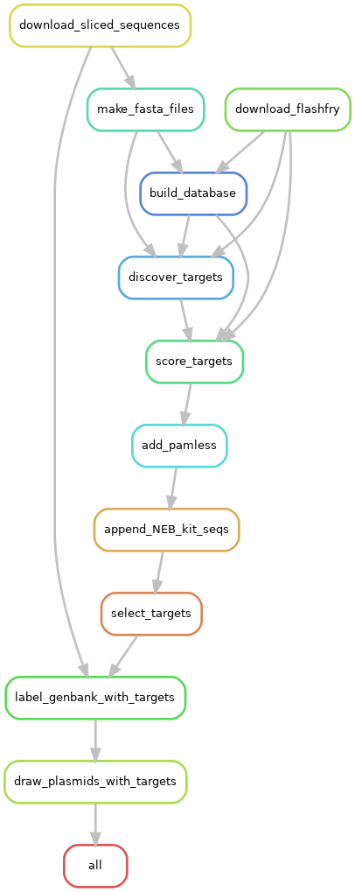
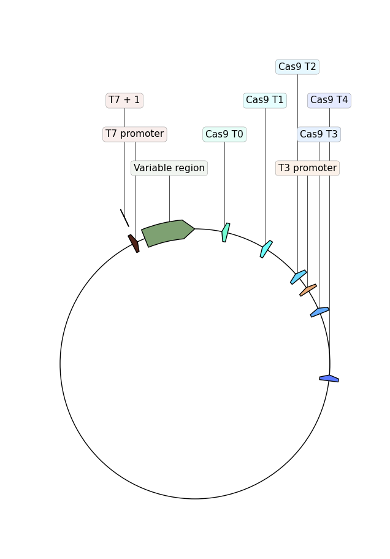

# VR-Cas9
Identify potential CRISPR-Cas9 targets in VR sequences using [FlashFry](https://bmcbiol.biomedcentral.com/articles/10.1186/s12915-018-0545-0).

## Dependencies

- [Conda](https://www.anaconda.com/products/individual)
- [Snakemake](https://snakemake.readthedocs.io/en/stable/)

## Run

The workflow can be run most easily with `snakemake -j 1 --configfile config.yml --use-conda`.
To run the workflow on a cluster reconfigure `cluster.yml` and `run.sh` to
work with your system (currently configured for SLURM (UC Davis CRICK)).

### Simplified workflow



### Configuration

Workflow configuration is done by making changes in the `config.yml` file.
Current parameters should be considered default. All parameters are explained
within `config.yml` itself.

## Output

```
output
├── databases
│   └── T7_initiation_series
├── genbank-labeled-with-targets
│   └── T7_initiation_series
├── plasmid-maps-with-targets
│   └── T7_initiation_series
├── scored-targets
│   └── T7_initiation_series
├── scored-targets-NEB
│   └── T7_initiation_series
├── scored-targets-pamless
│   └── T7_initiation_series
├── selected-scored-NEB
│   └── T7_initiation_series
├── sequences
│   ├── constructs
│   │   ├── T7_initiation_series
│   │   ├── T7_termination_series
│   │   ├── Tac_initiation_series
│   │   └── Tac_termination_series
│   └── fasta
│       └── T7_initiation_series
└── targets
    └── T7_initiation_series
```

`scored-targets` will contain `flashfry` discovered and scored guide RNA
sequences and metrics as a `tsv` for each VR insert. `selected-scored-targets-NEB`
will contain the final selected target sequences and the oligos that should
be ordered for use with NEB sgRNA expression kit. 

### Target visualization

The workflow will also draw a plasmid map showing the location of all selected
Cas9 target sites. The orientation refers to the direction of the target sequence.




